# Implementation Flow Documentation

## High-Level Architecture & Module Flow

This document provides a visual reference for the onboarding assistant's architecture, showing module dependencies, separation of concerns, and operational modes.

## 🔍 Architecture Overview (Simplified)

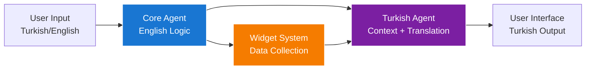

**Key Flow**: User speaks any language → Core Agent processes in English → Turkish Agent adds personality and translates → User sees warm Turkish responses

## System Architecture Flow (Detailed)

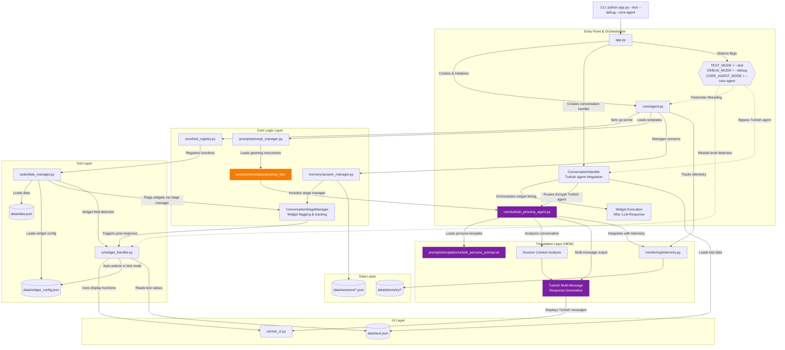

## 🔍 Separation of Concerns (Simplified)

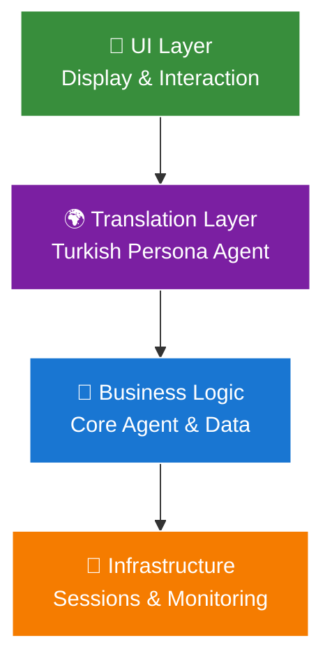

## Separation of Concerns (Detailed)

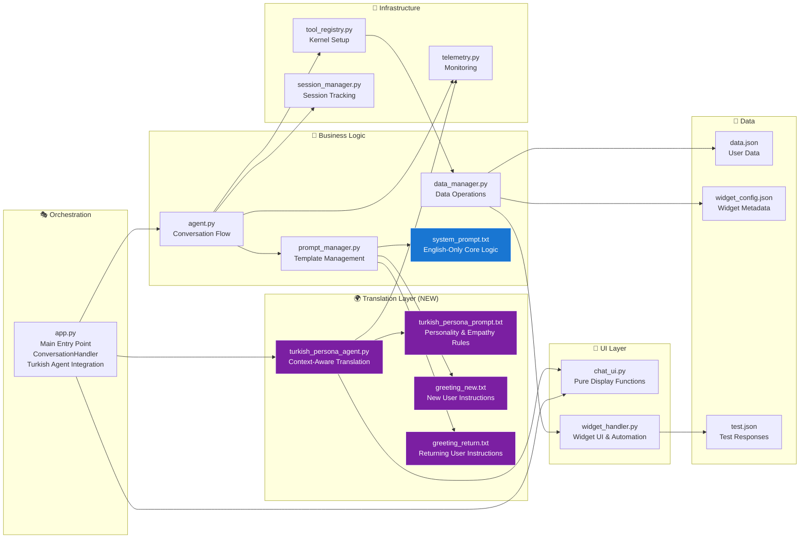

## 🔍 Mode Detection Overview (Simplified)

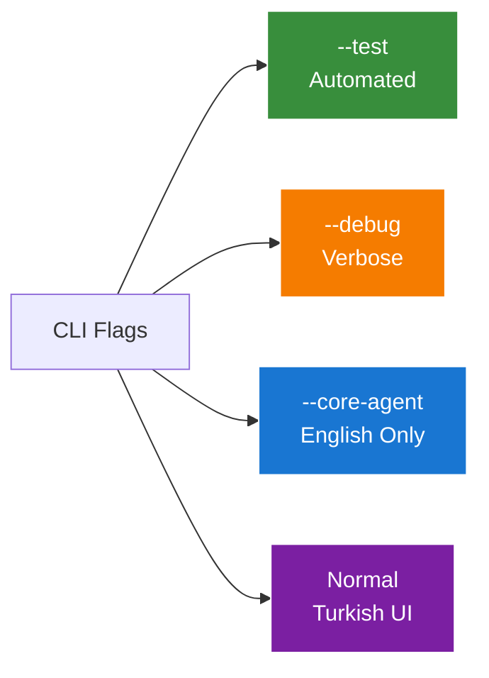

## Mode Detection & Control Flow (Detailed)

```mermaid
graph TD
    START[Application Start] --> DETECT{Detect CLI Flags}

    DETECT -->|"--test"| TEST_MODE[TEST_MODE = True]
    DETECT -->|"--debug"| DEBUG_MODE[DEBUG_MODE = True]
    DETECT -->|"--core-agent"| CORE_AGENT_MODE[CORE_AGENT_MODE = True]
    DETECT -->|"normal"| NORMAL_MODE[Normal Operation]

    subgraph "Test Mode Behavior"
        TEST_MODE --> TEST_APP[app.py: Uses test.json responses]
        TEST_MODE --> TEST_WIDGET[widget_handler.py: Auto-selects options]
        TEST_MODE --> TEST_TURKISH[Turkish agent: Context-aware responses]
        TEST_APP --> TEST_SEQ[Sequential test inputs]
        TEST_WIDGET --> TEST_AUTO[Automated widget selection]
        TEST_TURKISH --> TEST_EMPATHY[Empathetic Turkish output]
    end

    subgraph "Debug Mode Behavior"
        DEBUG_MODE --> DEBUG_AGENT[agent.py: Enhanced logging]
        DEBUG_MODE --> DEBUG_KERNEL[tool_registry.py: Function tracing]
        DEBUG_MODE --> DEBUG_TELEMETRY[telemetry.py: Full capture]
        DEBUG_MODE --> DEBUG_DATA[data_manager.py: Function logging]
        DEBUG_MODE --> DEBUG_TURKISH[turkish_persona_agent.py: Context logging]
    end

    subgraph "Core Agent Mode Behavior (NEW)"
        CORE_AGENT_MODE --> CORE_BYPASS[Bypass Turkish agent]
        CORE_AGENT_MODE --> CORE_ENGLISH[Show raw English responses]
        CORE_AGENT_MODE --> CORE_FUNCTIONS[Display function calls directly]
        CORE_AGENT_MODE --> CORE_DEBUG[Debug core logic without translation]
    end

    subgraph "Normal Mode Behavior"
        NORMAL_MODE --> NORMAL_CONV[Interactive conversation]
        NORMAL_MODE --> NORMAL_WIDGET[Manual widget selection]
        NORMAL_MODE --> NORMAL_TURKISH[Turkish persona responses]
        NORMAL_MODE --> NORMAL_MINIMAL[Minimal logging]
    end

    %% Override Options
    JUPYTER[Jupyter Override] -.->|"ui.widget_handler.TEST_MODE = True"| TEST_WIDGET

    style CORE_AGENT_MODE fill:#1976d2,stroke:#ffffff,color:#ffffff
    style CORE_BYPASS fill:#1976d2,stroke:#ffffff,color:#ffffff
    style CORE_ENGLISH fill:#1976d2,stroke:#ffffff,color:#ffffff
    style CORE_FUNCTIONS fill:#1976d2,stroke:#ffffff,color:#ffffff
    style CORE_DEBUG fill:#1976d2,stroke:#ffffff,color:#ffffff
    style TEST_TURKISH fill:#7b1fa2,stroke:#ffffff,color:#ffffff
    style DEBUG_TURKISH fill:#7b1fa2,stroke:#ffffff,color:#ffffff
    style NORMAL_TURKISH fill:#7b1fa2,stroke:#ffffff,color:#ffffff
```

## 🔍 Widget Flow Overview (Simplified)

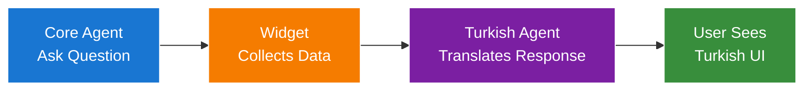

## Widget System Flow with Turkish Agent (Detailed)

```mermaid
sequenceDiagram
    participant LLM as Core Agent (English)
    participant DM as DataManager
    participant SM as StageManager
    participant CH as ConversationHandler
    participant TA as TurkishAgent
    participant WH as WidgetHandler
    participant UI as ChatUI
    participant TD as test.json

    Note over LLM,TD: Turkish Agent Integration with Widget System

    %% Block 1: LLM Question Phase
    LLM->>DM: ask_question(field="weight", message="What is your weight?")
    DM->>DM: _is_widget_field("weight") → True
    DM->>SM: flag_widget_needed(widget_info)
    Note over SM: Widget flagged for post-response execution
    DM-->>LLM: "[ASKING] weight: What is your weight?"
    LLM-->>CH: "Thank you! What's your weight?" (English)

    %% NEW: Turkish Agent Translation
    Note over CH,TA: Turkish Agent Processes English Response
    CH->>TA: translate_to_persona(english_response, session_context)
    TA->>TA: analyze_conversation_context()
    TA->>TA: determine_data_status(age/weight/height)
    TA->>TA: generate_empathetic_response()
    TA-->>CH: ["Süper! 😊", "Şimdi de kilondan bahsedelim mi?"] (Turkish, Multi-message)

    Note over CH,UI: Turkish response shown to user FIRST
    CH->>UI: print_agent_message("Süper! 😊")
    CH->>UI: print_agent_message("Şimdi de kilondan bahsedelim mi?")

    %% Block Separation: Widget executes AFTER Turkish response
    CH->>SM: get_pending_widget()
    SM-->>CH: widget_info (flagged widget)
    CH->>WH: _execute_widget_and_get_user_input(widget_info)
    WH->>WH: WidgetHandler() (lazy load)
    WH->>WH: show_widget_interface(question_structure)

    alt TEST_MODE = True
        WH->>TD: Load test data
        TD-->>WH: {"weight": "70kg"}
        WH->>UI: print_widget_box(options, selected="70kg")
        WH-->>CH: return "70kg"
    else Interactive Mode
        WH->>UI: print_widget_box(options)
        WH->>WH: input("Select option:")
        WH->>UI: print_widget_box(options, selected)
        WH-->>CH: return selected_value
    end

    %% Widget completion handling
    CH->>DM: update_data("weight", "70kg")
    DM-->>CH: "Updated weight to 70kg"
    CH->>SM: Store widget_completion (hidden context)

    %% Block 2: User Response Phase (NEW BLOCK)
    CH->>CH: Use widget selection as next user_input
    CH->>UI: print_user_message("70kg")

    %% Hidden context injection prevents duplicate updates
    CH->>LLM: process_user_input("70kg") + HIDDEN_CONTEXT
    Note over LLM: "CRITICAL: DO NOT call update_data for weight - already updated"
    LLM-->>CH: "Thank you! Now, could you tell me your height?" (English)

    %% Turkish Agent processes next response
    CH->>TA: translate_to_persona("Thank you! Now, could you tell me your height?", updated_context)
    TA-->>CH: ["Perfect! Kilonu kaydettim 📝", "Şimdi boyunu merak ediyorum!"] (Turkish)
    CH->>UI: print_agent_message("Perfect! Kilonu kaydettim 📝")
    CH->>UI: print_agent_message("Şimdi boyunu merak ediyorum!")

    style TA fill:#7b1fa2,stroke:#ffffff,color:#ffffff
    style LLM fill:#1976d2,stroke:#ffffff,color:#ffffff
```

## Stage Manager & Widget Flagging Architecture

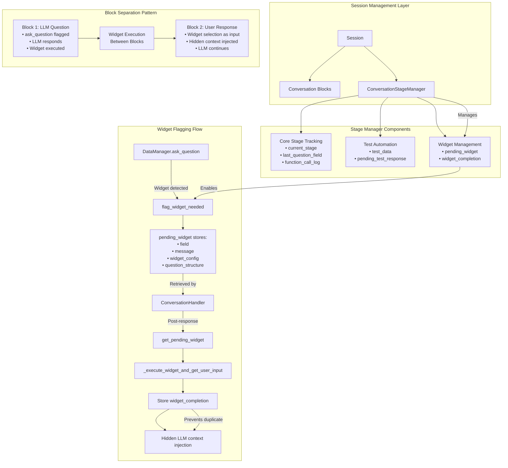

## Block Separation & Conversation Flow

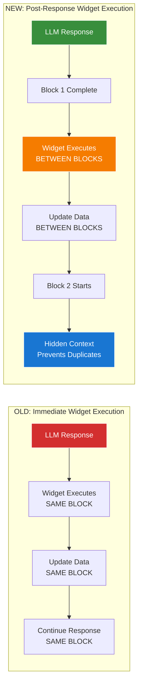

## Data Flow & Dependencies

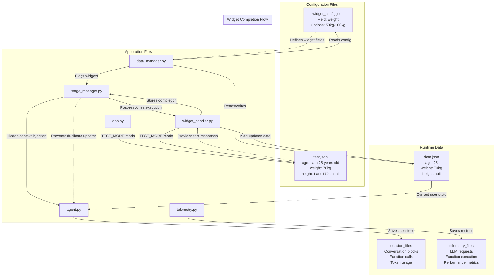

## Key Design Patterns

### 1. **Module-Level Mode Detection**

- `TEST_MODE = "--test" in sys.argv` in `ui/widget_handler.py`
- Avoids parameter threading through multiple layers
- Supports Jupyter override: `ui.widget_handler.TEST_MODE = True`

### 2. **Dual Tracking Architecture**

- **Stage 1 (Agent)**: Tracks LLM requests and responses
- **Stage 2 (DataManager)**: Tracks actual function execution
- Purpose: Debug LLM behavior vs execution vs routing issues

### 3. **Lazy Loading Pattern**

- WidgetHandler only loaded when widget field detected
- Prevents unnecessary imports and initialization

### 4. **Fail-Fast Principle**

- Template loading fails immediately if files missing
- No silent fallbacks that hide configuration issues

### 5. **Hidden Context Injection Pattern**

- Widget completions inject hidden context to prevent duplicate LLM calls
- LLM receives: `"CRITICAL: DO NOT call update_data for weight - it was already updated via widget to 70kg"`
- Context is invisible to chat UI but guides LLM behavior
- Prevents double-updating data fields from widget automation

### 6. **Widget Block Separation**

- Each question-answer cycle gets its own conversation block
- Widget execution happens BETWEEN blocks, not within blocks
- Maintains clean conversation flow while preserving all functionality

## Hidden Context Injection Mechanism

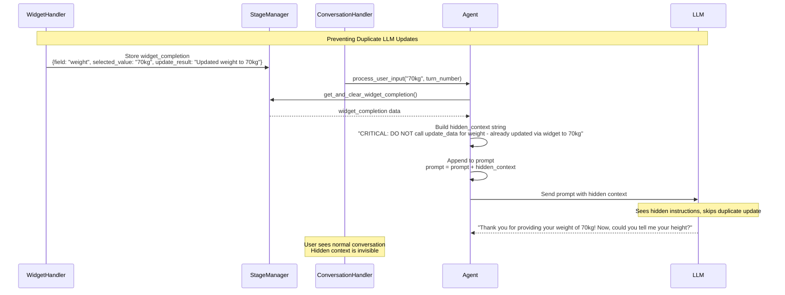

This mechanism ensures:

- **No duplicate updates**: Widget auto-updates are not repeated by LLM
- **Seamless UX**: Hidden context is invisible to chat interface
- **LLM guidance**: Clear instructions prevent confused behavior
- **State synchronization**: Widget completion data is properly cleared after use

## Key Design Patterns (Updated)

### 7. **Turkish Agent Translation Layer (NEW)**

- **English-Only Core**: Core agent always responds in English regardless of user language
- **Context-Aware Translation**: Turkish agent analyzes full conversation context and data status
- **Multi-Message Responses**: Single English response becomes multiple Turkish messages for natural flow
- **Empathetic Personality**: Adds warmth, empathy, and age-appropriate reactions
- **Core Agent Bypass**: `--core-agent` mode allows debugging without translation layer

### 8. **Instruction Architecture (NEW)**

- **Greeting Instructions**: Core agent sends instructions to Turkish agent, not direct user messages
- **Architectural Clarity**: Clear separation between backend logic (English) and frontend personality (Turkish)
- **Language Constraint**: Core agent strictly forbidden from using Turkish, maintains clean separation

## File Responsibility Summary (Updated)

| File                        | Primary Responsibility                    | Secondary Features                        |
| --------------------------- | ----------------------------------------- | ----------------------------------------- |
| `app.py`                    | ConversationHandler orchestration, Turkish agent integration | Post-response widget execution, CLI entry, mode detection |
| `core/agent.py`             | LLM interaction, hidden context injection | Session management, block completion      |
| `core/turkish_persona_agent.py` | **Context-aware Turkish translation, empathetic responses** | **Multi-message generation, data status analysis** |
| `core/tool_registry.py`     | Kernel setup, function registration       | Debug prints, telemetry setup             |
| `tools/data_manager.py`     | Data operations, widget flagging          | Stage manager integration, dual tracking  |
| `ui/widget_handler.py`      | Widget UI, test automation                | Post-response execution, auto-updates     |
| `ui/chat_ui.py`             | Pure display functions                    | Terminal formatting, widget boxes         |
| `memory/session_manager.py` | Session blocks, ConversationStageManager  | Widget flagging, hidden context storage   |
| `prompts/prompt_manager.py` | Template loading, prompt building         | Greeting selection, debug info            |
| `prompts/templates/system_prompt.txt` | **Core agent English-only behavior** | **Language constraint enforcement** |
| `prompts/templates/turkish_persona_prompt.txt` | **Turkish personality and empathy rules** | **Multi-message reasoning, completion detection** |
| `prompts/templates/greeting_new.txt` | **Instructions to Turkish agent for new users** | **Architectural clarity** |
| `prompts/templates/greeting_return.txt` | **Instructions to Turkish agent for returning users** | **User state awareness** |
| `monitoring/telemetry.py`   | Event capture, performance tracking       | Widget execution tracking, Turkish agent logging |

## Architecture Principles

This architecture follows the **separation of concerns** principle with clear boundaries between:

- **🎯 UI Layer**: Pure display functions
- **🌍 Translation Layer**: Turkish persona with context awareness
- **🧠 Business Logic**: English-only core agent and data operations
- **🔧 Infrastructure**: Sessions, monitoring, and widget management

**Key Innovation**: The Turkish Agent layer provides a sophisticated translation and personalization interface while maintaining clean separation between backend logic and frontend personality.
