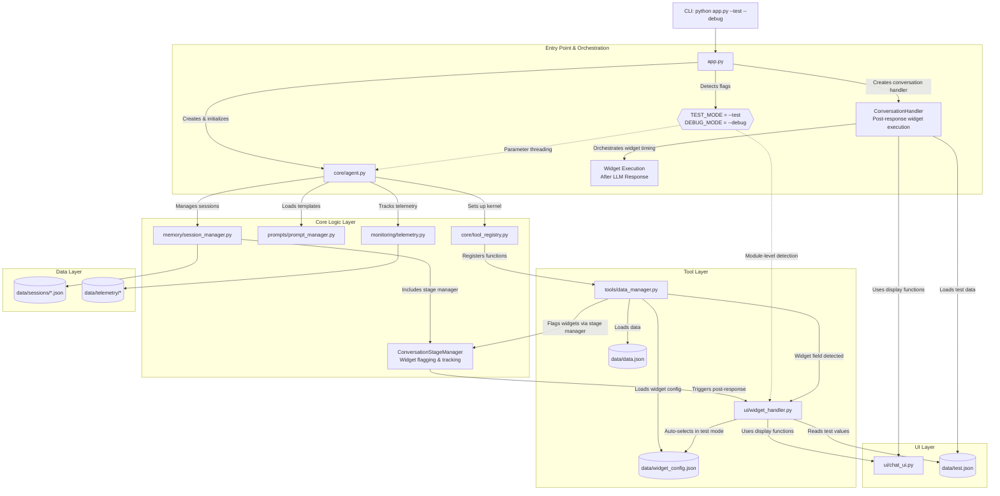
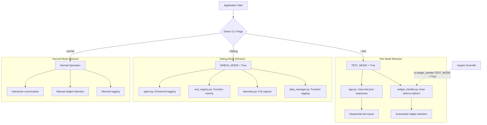
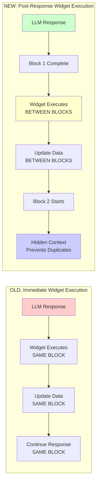

# Implementation Flow Documentation

## High-Level Architecture & Module Flow

This document provides a visual reference for the onboarding assistant's architecture, showing module dependencies, separation of concerns, and operational modes.

## System Architecture Flow

## Separation of Concerns

```mermaid
graph LR
    subgraph "🎯 UI Layer"
        UI1[chat_ui.py<br/>Pure Display Functions]
        UI2[widget_handler.py<br/>Widget UI & Automation]
    end

    subgraph "🧠 Business Logic"
        BL1[agent.py<br/>Conversation Flow]
        BL2[data_manager.py<br/>Data Operations]
        BL3[prompt_manager.py<br/>Template Management]
    end

    subgraph "🔧 Infrastructure"
        INF1[tool_registry.py<br/>Kernel Setup]
        INF2[session_manager.py<br/>Session Tracking]
        INF3[telemetry.py<br/>Monitoring]
    end

    subgraph "🎭 Orchestration"
        ORCH[app.py<br/>Main Entry Point<br/>ConversationHandler]
    end

    subgraph "💾 Data"
        DATA1[data.json<br/>User Data]
        DATA2[widget_config.json<br/>Widget Metadata]
        DATA3[test.json<br/>Test Responses]
    end

    ORCH --> UI1
    ORCH --> BL1
    BL1 --> INF1
    BL1 --> BL3
    BL1 --> INF2
    BL2 --> UI2
    BL2 --> DATA1
    BL2 --> DATA2
    UI2 --> DATA3
    INF1 --> BL2
    BL1 --> INF3
```

## Mode Detection & Control Flow

## Widget System Flow (POST-RESPONSE EXECUTION)

```mermaid
sequenceDiagram
    participant LLM as LLM (GPT-4o-mini)
    participant DM as DataManager
    participant SM as StageManager
    participant CH as ConversationHandler
    participant WH as WidgetHandler
    participant UI as ChatUI
    participant TD as test.json

    Note over LLM,TD: NEW: Widget Flagging & Post-Response Execution

    %% Block 1: LLM Question Phase
    LLM->>DM: ask_question(field="weight", message="What is your weight?")
    DM->>DM: _is_widget_field("weight") → True
    DM->>SM: flag_widget_needed(widget_info)
    Note over SM: Widget flagged for post-response execution
    DM-->>LLM: "[ASKING] weight: What is your weight?"
    LLM-->>CH: "Thank you! What's your weight?"

    Note over CH,UI: LLM response shown to user FIRST
    CH->>UI: print_agent_message("Thank you! What's your weight?")

    %% Block Separation: Widget executes AFTER LLM response
    CH->>SM: get_pending_widget()
    SM-->>CH: widget_info (flagged widget)
    CH->>WH: _execute_widget_and_get_user_input(widget_info)
    WH->>WH: WidgetHandler() (lazy load)
    WH->>WH: show_widget_interface(question_structure)

    alt TEST_MODE = True
        WH->>TD: Load test data
        TD-->>WH: {"weight": "70kg"}
        WH->>UI: print_widget_box(options, selected="70kg")
        WH-->>CH: return "70kg"
    else Interactive Mode
        WH->>UI: print_widget_box(options)
        WH->>WH: input("Select option:")
        WH->>UI: print_widget_box(options, selected)
        WH-->>CH: return selected_value
    end

    %% Widget completion handling
    CH->>DM: update_data("weight", "70kg")
    DM-->>CH: "Updated weight to 70kg"
    CH->>SM: Store widget_completion (hidden context)

    %% Block 2: User Response Phase (NEW BLOCK)
    CH->>CH: Use widget selection as next user_input
    CH->>UI: print_user_message("70kg")

    %% Hidden context injection prevents duplicate updates
    CH->>LLM: process_user_input("70kg") + HIDDEN_CONTEXT
    Note over LLM: "CRITICAL: DO NOT call update_data for weight - already updated"
    LLM-->>CH: "Thank you! Now, could you tell me your height?"
```

## Stage Manager & Widget Flagging Architecture

```mermaid
graph TD
    subgraph "Session Management Layer"
        SESSION[Session] --> BLOCKS[Conversation Blocks]
        SESSION --> SM[ConversationStageManager]
    end

    subgraph "Stage Manager Components"
        SM --> CORE_TRACKING[Core Stage Tracking<br/>• current_stage<br/>• last_question_field<br/>• function_call_log]
        SM --> TEST_MODE[Test Automation<br/>• test_data<br/>• pending_test_response]
        SM --> WIDGET_MGT[Widget Management<br/>• pending_widget<br/>• widget_completion]
    end

    subgraph "Widget Flagging Flow"
        DM[DataManager.ask_question] -->|Widget detected| FLAG[flag_widget_needed]
        FLAG --> PENDING[pending_widget stores:<br/>• field<br/>• message<br/>• widget_config<br/>• question_structure]

        CH[ConversationHandler] -->|Post-response| CHECK[get_pending_widget]
        CHECK --> EXECUTE[_execute_widget_and_get_user_input]
        EXECUTE --> COMPLETION[Store widget_completion]
        COMPLETION --> HIDDEN[Hidden LLM context injection]
    end

    subgraph "Block Separation Pattern"
        BLOCK1[Block 1: LLM Question<br/>• ask_question flagged<br/>• LLM responds<br/>• Widget executed]
        BLOCK2[Block 2: User Response<br/>• Widget selection as input<br/>• Hidden context injected<br/>• LLM continues]

        BLOCK1 --> WIDGET_EXECUTION[Widget Execution<br/>Between Blocks]
        WIDGET_EXECUTION --> BLOCK2
    end

    %% Connections
    SM -->|Manages| WIDGET_MGT
    WIDGET_MGT -->|Enables| FLAG
    PENDING -->|Retrieved by| CH
    COMPLETION -->|Prevents duplicate| HIDDEN
```

## Block Separation & Conversation Flow

## Data Flow & Dependencies

## Key Design Patterns

### 1. **Module-Level Mode Detection**

- `TEST_MODE = "--test" in sys.argv` in `ui/widget_handler.py`
- Avoids parameter threading through multiple layers
- Supports Jupyter override: `ui.widget_handler.TEST_MODE = True`

### 2. **Dual Tracking Architecture**

- **Stage 1 (Agent)**: Tracks LLM requests and responses
- **Stage 2 (DataManager)**: Tracks actual function execution
- Purpose: Debug LLM behavior vs execution vs routing issues

### 3. **Lazy Loading Pattern**

- WidgetHandler only loaded when widget field detected
- Prevents unnecessary imports and initialization

### 4. **Fail-Fast Principle**

- Template loading fails immediately if files missing
- No silent fallbacks that hide configuration issues

### 5. **Hidden Context Injection Pattern**

- Widget completions inject hidden context to prevent duplicate LLM calls
- LLM receives: `"CRITICAL: DO NOT call update_data for weight - it was already updated via widget to 70kg"`
- Context is invisible to chat UI but guides LLM behavior
- Prevents double-updating data fields from widget automation

### 6. **Widget Block Separation**

- Each question-answer cycle gets its own conversation block
- Widget execution happens BETWEEN blocks, not within blocks
- Maintains clean conversation flow while preserving all functionality

## Hidden Context Injection Mechanism

This mechanism ensures:

- **No duplicate updates**: Widget auto-updates are not repeated by LLM
- **Seamless UX**: Hidden context is invisible to chat interface
- **LLM guidance**: Clear instructions prevent confused behavior
- **State synchronization**: Widget completion data is properly cleared after use

## File Responsibility Summary

| File                        | Primary Responsibility                    | Secondary Features                        |
| --------------------------- | ----------------------------------------- | ----------------------------------------- |
| `app.py`                    | ConversationHandler orchestration         | Post-response widget execution, CLI entry |
| `core/agent.py`             | LLM interaction, hidden context injection | Session management, block completion      |
| `core/tool_registry.py`     | Kernel setup, function registration       | Debug prints, telemetry setup             |
| `tools/data_manager.py`     | Data operations, widget flagging          | Stage manager integration, dual tracking  |
| `ui/widget_handler.py`      | Widget UI, test automation                | Post-response execution, auto-updates     |
| `ui/chat_ui.py`             | Pure display functions                    | Terminal formatting, widget boxes         |
| `memory/session_manager.py` | Session blocks, ConversationStageManager  | Widget flagging, hidden context storage   |
| `prompts/prompt_manager.py` | Template loading, prompt building         | Greeting selection, debug info            |
| `monitoring/telemetry.py`   | Event capture, performance tracking       | Widget execution tracking, file export    |

This architecture follows the **separation of concerns** principle with clear boundaries between UI, business logic, infrastructure, and data layers.
